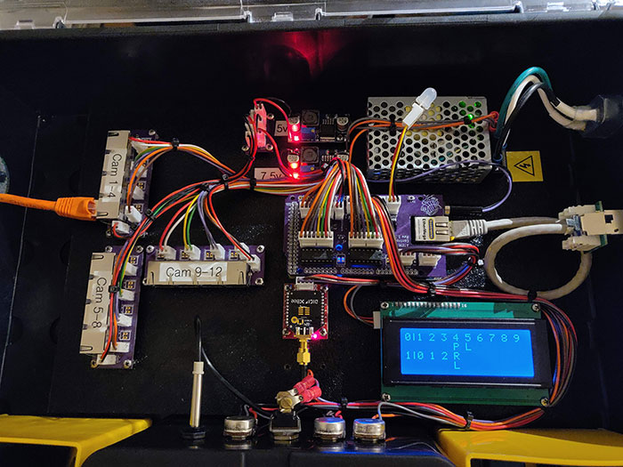

Arduino based tally controller using the Arduino Mega w/ Ethernet.

Configuration of the tally controller is done via serial connection.  To configure send the following:

|Setting|Command|Note|
|---|---|---|
|Controller's IP|`Ix.x.x.x`|Replace x's with the controller's IP address|
|Controller's Netmask|`Nx.x.x.x`|Replace the x's with the controller's netmask|
|ATEM's IP|`Ax.x.x.x`|Replace the x's with the ATEM's IP address|
|Remote Camera #|`Rx`|Replace the x's with the camera # the wireless tally light is attached to|

Sample build of ATEM tally controller built in a parts organizer for portability for on-location use at conventions.

# BOM:

## Controller Board:

For `tally-controller-shield-smd.brd`

|Component|Quantity|Notes|Link|
|---|---|---|---|
|Controller Shield PCB|1|Can have board fabbed anywhere.|[Link](https://oshpark.com/shared_projects/vglxha97)|
|Freetronics EtherMEGA|1|Arduino Mega + Ethernet bundle.  I do not recommend using the Mega ETH from RobotDyn.|[Link](https://www.freetronics.com.au/products/ethermega-arduino-mega-2560-compatible-with-onboard-ethernet)|
|SN75174N RS485 Quad Line Driver|3| |[Link](https://www.mouser.com/ProductDetail/595-SN75174N)|
|LM2596 DC/DC buck converters|2|I used 1 for the main 5v for the project, and the other just for powering the Ethermega|[Link](https://www.amazon.com/dp/B06XZ1DKF2/ref=cm_sw_em_r_mt_dp_U_vQXREb0CJX45Z)|
|Molex 22-23-2021 2-pin header|4| |[Link](https://www.mouser.com/ProductDetail/538-22-23-2021)|
|Molex 22-23-2031 3-pin header|3| |[Link](https://www.mouser.com/ProductDetail/538-22-23-2031)|
|Molex 22-23-2041 4-pin header|2| |[Link](https://www.mouser.com/ProductDetail/538-22-23-2041)|
|Molex 22-23-2081 8-pin header|3| |[Link](https://www.mouser.com/ProductDetail/538-22-23-2081)|
|470ohm 0805 SMD resistor|1| | |
|10kohm 0805 SMD resistor|1| | |
|4.7kohm 0805 SMD resistor|1| | |
|120ohm 0805 SMD resistor|12| | |
|0.1uf 0805 SMD ceramic capacitor|3| | |
|10kohm potentiometer|2| |[Link](https://www.mouser.com/ProductDetail/858-P231-QC15BR10K)|
|1kohm potentiometer|1| | |
|Potentiometer knob|3| |[Red](https://www.mouser.com/ProductDetail/450-3021), [Green](https://www.mouser.com/ProductDetail/450-3024), [Blue](https://www.mouser.com/ProductDetail/450-3023), [Yellow](https://www.mouser.com/ProductDetail/450-3022)
|SPST Toggle Swithch|1| | |
|Mean Well RS-25-12 Power Supply|1| |[Link](https://www.mouser.com/ProductDetail/709-RS25-12)|
|Sparkfun XBee regulated breakout|1|Optional|[Link](https://www.mouser.com/ProductDetail/474-WRL-11373)|
|XBee Pro Transciever|1|Optional|[Link](https://www.mouser.com/ProductDetail/888-XB3-24Z8ST)|
|Dome atenna for Xbee|1|Optional|[Link](https://www.mouser.com/ProductDetail/712-ANT-DB1-WRT-RPS)|
|20x4 LCD i2c Display|1|Can be had cheap off ebay| |

## Camera output board:

For `RJ45 4ch Outout.brd`

Quantities noted here are for each output board.  Multiply as needed for multiple boards.

|Component|Quantity|Notes|Link|
|---|---|---|---|
|Output PCB|1|Oshpark minimum order is 3|[Link](https://oshpark.com/shared_projects/SH81yZph)|
|Amphenol RJHSE-5380-04|1|4-port RJ45 module|[Link](https://www.mouser.com/ProductDetail/523-RJHSE-5380-04)|
|Molex 22-23-2021 2-pin header|4|Only needed for CAM#DATA1 headers.  CAM#DATA2 is unused currently.|[Link](https://www.mouser.com/ProductDetail/538-22-23-2021)|

## Power distribution

For `Output Power Distro.brd`

Small board for distributing the 5v power to the controller shield, camera output boards

|Component|Quantity|Notes|Link|
|---|---|---|---|
|Power Distro PCB|1|Oshpark minimum order is 3|[Link](https://oshpark.com/shared_projects/CbdMb8Fg)|
|Molex 22-23-2021 2-pin header|6|Only needed for CAM#DATA1 headers.  CAM#DATA2 is unused currently.|[Link](https://www.mouser.com/ProductDetail/538-22-23-2021)|
